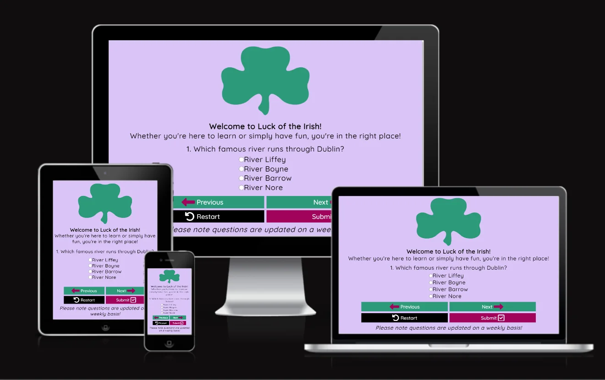
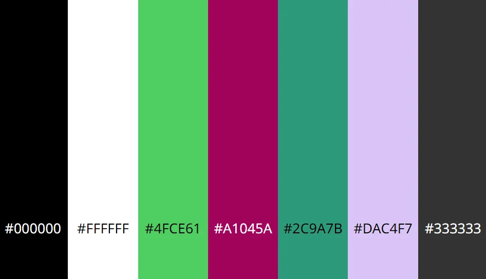

<!-- omit in toc -->
# Luck of the Irish Quiz

The Luck of the Irish Quiz is so the user can learn in a fun way or just to test
their general knowledge about Ireland.

Deployed site: [Luck of the Irish](https://anneenglish.github.io/Portfolio-2/)

---

<!-- omit in toc -->
## Table of Contents

- [User Experience](#user-experience)
  - [Initial Discussion](#initial-discussion)
  - [User Stories](#user-stories)
- [Design](#design)
  - [Colour Scheme](#colour-scheme)
  - [Typography](#typography)
  - [Imagery](#imagery)
  - [Features](#features)
  - [Accessibility](#accessibility)
- [Technologies Used](#technologies-used)
  - [Languages Used](#languages-used)
  - [Libraries and Programs Used](#libraries-and-programs-used)
- [Deployment and Local Development](#deployment-and-local-development)
  - [Deployment(GitHub Pages)](#deploymentgithub-pages)
  - [Local Development](#local-development)
- [Testing](#testing)
  - [Testing User Stories from UX Section](#testing-user-stories-from-ux-section)
  - [Further Testing](#further-testing)
  - [Known Bugs](#known-bugs)
- [Credits](#credits)
  - [Code](#code)
  - [Content](#content)
  - [Media](#media)
  - [Acknowledgements](#acknowledgements)

---

## User Experience

### Initial Discussion

The Luck of the Irish is a website designed for the user to gain or test their
knowledge of Ireland in a fun way, by using a quiz. We update our quiz questions
weekly, for returning or frequent visitors so they can keep improving their
knowledge.

### User Stories

<!-- omit in toc -->
#### First Time Visitor Goals

- I want to be able to improve my general knowledge of Ireland in a fun way.
- I want the site to be easy to navigate.
- I want to be able to view my score at the end of the quiz.

<!-- omit in toc -->
#### Returing Visitor Goals

* I want to have different questions each time I visit so in order to learn more.

<!-- omit in toc -->
#### Frequent Visitor Goals

* I want to keep improving my knowledge.

## Design

### Colour Scheme

The colour scheme for the website was created by me, not using a colour palette
generator. I chose these colours as I felt thyy tied in well with the theme of
the quiz.

In my style.css file I used variables to declare the colours above.
This is how I used the colours for my site:

- Body background colour: #DAC4F7
- Previous and next button background colour: #2C9A7B
- Restart background colour: #000000
- Submit background colour: #A1045A
- H1, paragraph and question content area text colour: #000000
- Button text colour: #FFFFFF
- When hovering over options background colour: #4FCE61
- When hovering over restart button background colour: #333333

### Typography

Google Fonts was used to import the fonts used on this site.
The fonts I chose are:

- 'Croissant One (Regular 400)' for the heading element.
- 'Quicksand (Medium 500)' for all other text.

### Imagery

There is one image used on this site and it is the logo. It is from Google Images
and I have also credited it in the credit section with a link to the image.

### Features

The website consists of one page (index.html). This page contains the following:

- A favicon in the browser tab.
- The title of the site which is also in the browser tab and then in an H1 element
  with a welcome message.
- Question content area which will display the questions and options.
- Four buttons below the question content.
  - Previous: To go back to previous question.
  - Next: To go to the next question, provided the current question has been
    answered. If it hasn't been answered it will display an alert message
    which prompts the user to select an answer first.
  - Restart: To go back to the very beginning of the quiz.
  - Submit: To submit answers and show score at the end of the quiz. If the user
    tries to submit their answers before all the questions have been answered
    it will display an alert message prompting the user to answer all of the
    questions first.
- A footer which contains the text '*Our quiz is updated weekly!'.

<!-- omit in toc -->
#### Future Implementations

In future implementations I would like to do the following:

- Give users the option to choose the quiz difficulty.
- Give the user an option to create an account so they can store and view
  previous scores.
- Create a backend-end database so I can store the scores and the user would be
  able to see how they scored against other users.

### Accessibility

I have been very mindful when creating this website to make sure that it is
accessible for all users by doing the following:

- Using semantic HTML.
- When hovering over an option the background colour changes to #4FCE61 which
  highlights the fact they are hovering over it.
- When hovering over any button (except restart) the background colour gets
  darker to indicate it.
- When hovering over the restart button the colour changes from #000000 to
  #333333, which is a lighter shade of black.
- Ensuring that there is sufficient contrast throughout the site.

## Technologies Used

### Languages Used

HTML, CSS and Javascript.

### Libraries and Programs Used

1. [Git](https://git-scm.com/): For version control.
2. [Github:](https://github.com/): GitHub was used to store and save the
   projects code after being pushed from Git.
3. [Chrome DevTools:](https://developer.chrome.com/docs/devtools/): Chrome
   DevTools was used to test features and fix styling and responsiveness issues.
4. [Online Convert:](https://www.online-convert.com/): Online Convert was used
   to convert images to WEBP for faster loading times on the site.
5. [Am I Responsive?](http://ami.responsivedesign.is/): Am I Responsive was used
   to show the responsiveness of the website on a range of devices.
6. [Google Fonts:](https://fonts.google.com/): Google Fonts was used to import
   the 'Croissant One' and 'Quicksand' fonts used throughout website page by
   importing them into the style.css file.
8. [Font Awesome:](https://fontawesome.com/): Font Awesome was used for the
   website to add icons for the buttons. It was also used for aesthetic and UX.

## Deployment and Local Development

### Deployment(GitHub Pages)

The project was deployed to GitHub Pages using the following steps:

1. Log into [Github](https://github.com/)
2. Locate and click on the GitHub Repository for the project you want to deploy.
3. Locate the 'settings' for the repository. This will be at the top of the
   repository (**not the top of the page**).
4. Scroll through the settings until you see 'Pages' and click on it. This will
   be in the navigation bar on the left of your screen.
5. Under the heading 'source' click on the dropdown menu and select
   'deploy from branch'.
6. Under the 'branch' heading just below select 'main' from the first dropdown
   menu, from the second dropdown menu select '/ (root)'.
7. After you complete these steps make sure to save. The button for this is to
   the right of the second dropdown menu.
8. Scroll to the top of the page and you will find the link for the published
   site.

### Local Development

<!-- omit in toc -->
#### Forking the Github Repository

Forking a GitHub repository is making a copy of the original on our account. We can view/edit without affecting the original repository. Follow the steps below to do this:

1. Log into [Github](https://github.com/)
2. Locate and click on the GitHub Repository for the project you want to fork.
3. Just below the 'settings' for the repository you will see 'fork'. Click on it and you should now have a copy of the original repository on your GitHub account.

<!-- omit in toc -->
#### Making a Local Clone

1. Log into [Github](https://github.com/)
2. Locate the GitHub repository for the project you want to clone.
3. Locate and click on the green 'code' button. This should be just below the
   'settings'.
4. Choose whether you would like to clone with 'HTTPS', 'SSH' or 'GitHub CLI'.
5. Copy the link after you select one of the options above.
6. Open the terminal for your code editor and change the current working
   directory to the location where you want the cloned directory to be made.
7. Type 'git clone' into the terminal followed by the link you copied in Step 5
   (paste the link into terminal).
8. Press 'enter' and your local clone will be created.

## Testing

### Testing User Stories from UX Section

### Further Testing

### Known Bugs

## Credits

### Code

### Content

### Media

### Acknowledgements
