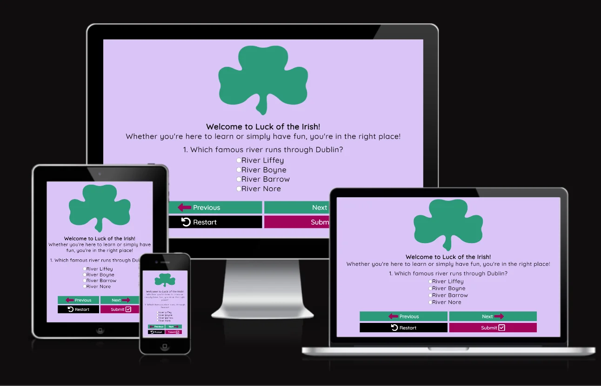

# Luck of the Irish Quiz

The Luck of the Irish Quiz is so the user can learn in a fun way or just to test
their general knowledge about Ireland.

Deployed site: [Luck of the Irish](https://anneenglish.github.io/Portfolio-2/)

---

## Table of Contents

* User Experience
  * User Stories

* Design
  * Colour Scheme
  * Typography
  * Imagery
  * Features
  * Accessibility

* Technologies Used
  * Languages Used
  * Libraries and Programs Used

* Deployment and Local Development
  * Deployment(GitHub Pages)
  * Local Development

* Testing
  * Testing User Stories from UX Section
  * Further Testing
  * Known Bugs

* Credits
  * Code
  * Content
  * Media
  * Acknowledgements

---

## User Experience

### User Stories

## Design

### Colour Scheme

### Typography

### Imagery

### Features

### Accessibility

## Technologies Used

### Languages Used

### Libraries and Programs Used

## Deployment and Local Development

### Deployment(GitHub Pages)

### Local Development

## Testing

### Testing User Stories from UX Section

### Further Testing

### Known Bugs

## Credits

### Code

### Content

### Media

### Acknowledgements
