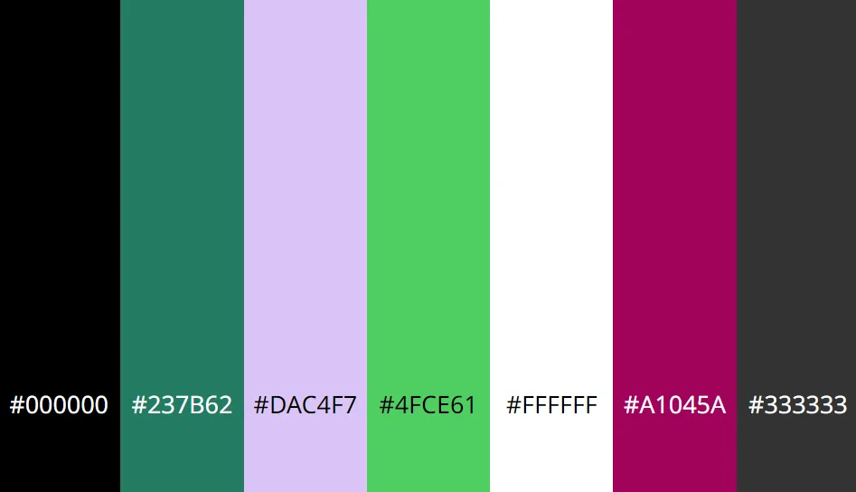

<!-- omit in toc -->
# Luck of the Irish Quiz

The Luck of the Irish Quiz is so the user can learn in a fun way or just to test
their general knowledge about Ireland.

Deployed site: [Luck of the Irish](https://anneenglish.github.io/Portfolio-2/)

---

<!-- omit in toc -->
## Table of Contents

- [User Experience](#user-experience)
  - [User Stories](#user-stories)
    - [Initial Discussion](#initial-discussion)
    - [First Time Visitor Goals](#first-time-visitor-goals)
    - [Returing Visitor Goals](#returing-visitor-goals)
    - [Frequent Visitor Goals](#frequent-visitor-goals)
- [Design](#design)
  - [Colour Scheme](#colour-scheme)
  - [Typography](#typography)
  - [Imagery](#imagery)
  - [Features](#features)
  - [Accessibility](#accessibility)
- [Technologies Used](#technologies-used)
  - [Languages Used](#languages-used)
  - [Libraries and Programs Used](#libraries-and-programs-used)
- [Deployment and Local Development](#deployment-and-local-development)
  - [Deployment(GitHub Pages)](#deploymentgithub-pages)
  - [Local Development](#local-development)
- [Testing](#testing)
  - [Testing User Stories from UX Section](#testing-user-stories-from-ux-section)
  - [Further Testing](#further-testing)
  - [Known Bugs](#known-bugs)
- [Credits](#credits)
  - [Code](#code)
  - [Content](#content)
  - [Media](#media)
  - [Acknowledgements](#acknowledgements)

---

## User Experience

### User Stories

#### Initial Discussion

The Luck of the Irish is a website designed for the user to gain or test their
knowledge of Ireland in a fun way, by using a quiz. We update our quiz questions
weekly, for returning or frequent visitors so they can keep improving their
knowledge.

#### First Time Visitor Goals

- I want to be able to improve my general knowledge of Ireland in a fun way.
- I want the site to be easy to navigate.
- I want to be able to view my score at the end of the quiz.

#### Returing Visitor Goals

* I want to have different questions each time I visit so in order to learn more.

#### Frequent Visitor Goals

* I want to keep improving my knowledge.

## Design

### Colour Scheme

The colour scheme for the website was created by me, not using a colour palette
generator. I chose these colours as I felt 

### Typography

### Imagery

### Features

### Accessibility

## Technologies Used

### Languages Used

### Libraries and Programs Used

## Deployment and Local Development

### Deployment(GitHub Pages)

### Local Development

## Testing

### Testing User Stories from UX Section

### Further Testing

### Known Bugs

## Credits

### Code

### Content

### Media

### Acknowledgements
